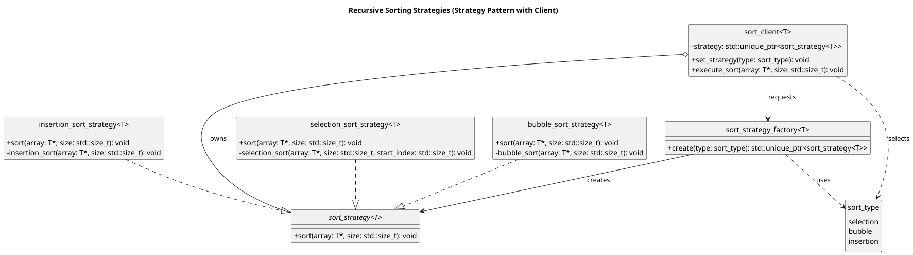
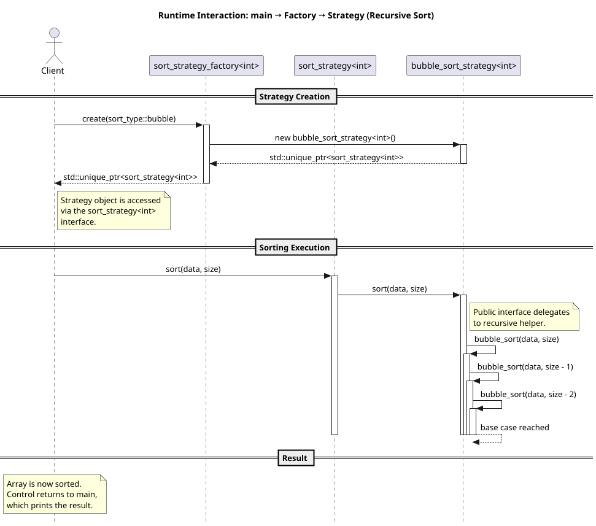

# LAB11 - Exploring Basic Sorting Algorithms

[//]: # (Make sure you update the following URL with the correct repo name)
[](https://github.com/msu-csc232-sp26/lab11-solution/actions/workflows/autograding.yml)

*Applying the Strategy design pattern to implement recursive sorting algorithms in modern C++.*

## Background

In previous coursework, you have likely implemented sorting algorithms as standalone functions or as part of a single
class. While this approach works for small programs, it does not scale well as the number of algorithms grows or when
algorithms must be selected dynamically at runtime.

This lab introduces a more extensible design that separates:

- **what** an algorithm does,
- **how** it is selected, and
- **where** it is used.

Before proceeding with this lab, you should review the following topics from lecture and the textbook:

- Recursion and base cases
- Classic comparison-based sorting algorithms
    - Selection sort
    - Bubble sort
    - Insertion sort
- Interfaces and polymorphism in C++
- Templates and generic programming
- The Strategy design pattern

### The Strategy Pattern

The Strategy Pattern defines a *family of algorithms*, encapsulates each one, and makes them interchangeable. The
algorithm can vary independently of the client that uses it.

In this lab, the family of algorithms consists of three sorting strategies:

- Recursive selection sort
- Recursive bubble sort
- Recursive insertion sort

Each algorithm is implemented as a **concrete strategy** that adheres to a common interface.

#### Classes Involved

At a high level, the design consists of:

- A **strategy interface** (`sort_strategy<T>`) defining a common `sort` operation
- Multiple **concrete strategies** implementing different sorting algorithms
- A **factory** responsible for creating strategy objects
- A **client** that uses a strategy without knowing its concrete type

The following UML class diagram illustrates the relationships between these components:



Key observations:

- The client depends only on the strategy *interface*, not concrete implementations
- Concrete sorting strategies can be added without modifying the client
- Object creation is centralized in the factory

#### Strategy Usage at Runtime

At runtime, the client requests a sorting strategy from the factory based on a given selection criterion (an enumeration
value). The factory constructs the appropriate concrete strategy and returns it via the strategy interface.

Once created, the client invokes the `sort` operation polymorphically. The selected algorithm executes, including any
recursive helper calls, entirely within the concrete strategy.

This runtime interaction is illustrated in the following sequence diagram:



Notice that:

- The client never directly instantiates a concrete sorting strategy
- Recursive behavior is completely encapsulated within each strategy
- The client’s code does not change when a different algorithm is selected

## Objective

Upon successful completion of this lab, you will have learned how to:

- Implement classic sorting algorithms using **recursion**
- Encapsulate algorithms using the **Strategy design pattern**
- Apply **runtime polymorphism** via interfaces
- Use a **factory** to decouple object creation from usage
- Write generic, reusable code using **templates**
- Work within an existing design without modifying public interfaces
- Validate behavior using automated unit tests and incremental task builds

This lab emphasizes both **algorithmic thinking** and **software design principles**, mirroring techniques used in
larger, real‑world C++ systems.

## Getting Started

After accepting this assignment with the provided GitHub Classroom Assignment link, decide how you want to work with
your newly created repository:

* Using Codespaces directly in your web browser that employees the Visual Studio Code online IDE, or
* Using the IDE of your choice on your local machine

See [setup](setup.md) for more details around setting up your development environment once you've cloned your
assignment.

## Tasks

This lab is divided into three tasks that build on one another. You are expected to complete them **sequentially**,
ensuring that each previous task continues to work as you progress.

### General Guidelines

- **Do not modify any `TEST_TASK*` macros.**  
  Task selection is handled by the build system, not by editing source code.

- **Only work in the strategy implementation files** provided for each task.  
  You should not modify headers, test files, or factory logic.

- **Use the appropriate build preset for the task you are working on.**  
  Each preset enables tests for the current task *and all previous tasks*.

- **Run tests frequently.**  
  Failing earlier tests usually indicates a regression that must be fixed before moving forward.

This assignment consists of the following tasks:

* Task 1: Recursive Selection Sort
* Task 2: Recursive Bubble Sort
* Task 3: Recursive Insertion Sort

### Task 1: Implement the Selection Sort strategy recursively

Enumerated below are the essential steps to completing this task. For a deeper dive before you begin, see
the [Task 1 Details](task1.md) document.

- Implement the recursive helper for the selection sort strategy.
- Focus on correctly identifying:
    - the base case,
    - the recursive step, and
    - proper index management.

To build and test Task 1:

```shell
cmake --preset task1
cmake --build build/task1
ctest --test-dir build/task1 --output-on-failure
python3 grading/grade.py
```

Only Task 1 tests will run at this stage.

### Task 2: Implement the Bubble Sort strategy recursively

Enumerated below are the essential steps to completing this task. For a deeper dive before you begin, see
the [Task 2 Details](task2.md) document.

- Implement the recursive bubble sort strategy.
- Ensure that your solution:
    - performs exactly one pass per recursive call,
    - correctly reduces the problem size,
    - does not break Task 1 functionality.

To build and test Tasks 1 and 2:

```shell
cmake --preset task1-2
cmake --build build/task1-2
ctest --test-dir build/task1-2 --output-on-failure
python3 grading/grade.py
```

Tests for both Task 1 and Task 2 will run.

### Task 3: Implement the Insertion Sort strategy recursively

Enumerated below are the essential steps to completing this task. For a deeper dive before you begin, see
the [Task 3 Details](task3.md) document.

- Implement the recursive insertion sort strategy.
- Pay close attention to:
    - the order of recursion versus insertion,
    - index boundaries and unsigned integer behavior,
    - preserving correctness for previously completed tasks.

To build and test Tasks 1–3:

```shell
cmake --preset all-tasks
cmake --build build/all-tasks
ctest --test-dir build/all-tasks --output-on-failure
python3 grading/grade.py
```

## Submission Details

Before submitting your assignment, be sure you have pushed all your changes to GitHub. If this is the first time you're
pushing your changes, the push command will look like:

```bash
git push -u origin develop
```

If you've already set up remote tracking (using the `-u origin develop` switch), then all you need to do is type

```bash
git push
```

As usual, prior to submitting your assignment on Brightspace, be sure that you have committed and pushed your final
changes to GitHub. Once your final changes have been pushed, create a pull request that seeks to merge the changes in
your `develop` branch into your `main` branch.

You can use `gh` to create this pull request right from your command-line prompt:

```bash
gh pr create --assignee "@me" --title "Some appropriate title" --body "A message to populate description, e.g., Go Bills!" --head develop --base main --reviewer msu-csc232-fa25/graders
```

An "appropriate" title is at a minimum, the name of the assignment, e.g., `LAB02` or `HW04`, etc.

Once your pull request has been created, submit the URL of your assignment _repository_ (i.e., _not_ the URL of the pull
request) as a Text Submission on Brightspace. Please note: the timestamp of the submission on Brightspace is used to
assess any late penalties if and when warranted, _not_ the date/time you create your pull request. **No exceptions will
be granted for this oversight**.

### Due Date

Your lab submission is due by the end of the lab period.

### Grading Rubric

This assignment is worth **3 points**.

| Criteria           | Exceeds Expectations | Meets Expectations                 | Below Expectations                 | Failure                                        |
|--------------------|----------------------|------------------------------------|------------------------------------|------------------------------------------------|
| Code Style (10%)   | Exemplary code style | Consistent, modern coding style    | Inconsistent coding style          | No style whatsoever or no code changes present |
| Correctness^ (90%) | All unit tests pass  | At most 75% of the unit tests pass | At most 50% of the unit tests pass | Less than 50% of the unit tests pass           |

^ _The Google Test unit runner will calculate the correctness points based purely on the fraction of tests passed_.

### Late Penalty

* In the first 24-hour period following the due date, this assignment will be penalized 20%.
* In the second 24-hour period following the due date, this assignment will be penalized 40%.
* After 48 hours, the assignment will not be graded and thus earns no points.

## Disclaimer & Fair Use Statement

This repository may contain copyrighted material, the use of which may not
have been specifically authorized by the copyright owner. This material is
available in an effort to explain issues relevant to the course or to
illustrate the use and benefits of an educational tool. The material
contained in this repository is distributed without profit for research and
educational purposes. Only small portions of the original work are being
used and those could not be used to easily duplicate the original work.
